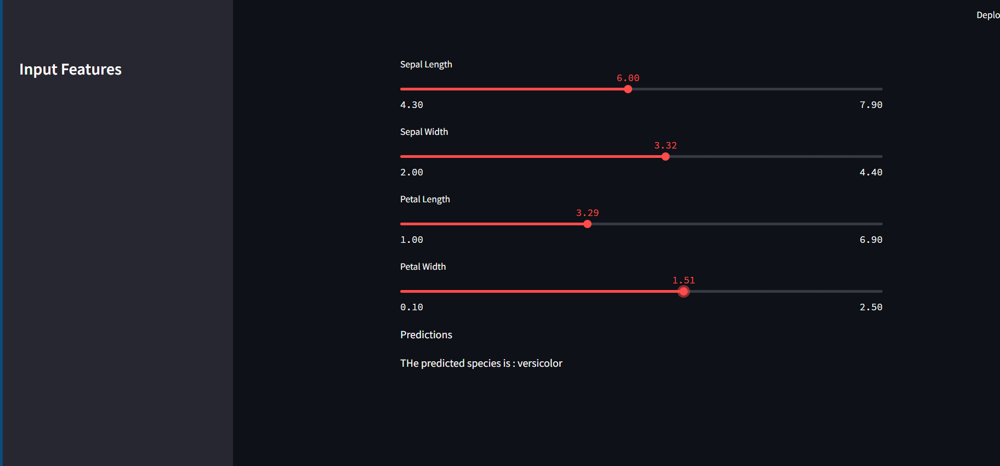

# Iris Species Classifier - Random Forest Model with Streamlit

This repository contains a web application built using **Streamlit** to classify Iris flower species based on a **Random Forest Classifier** model trained on the popular **Iris dataset**. This project demonstrates a simple deployment of machine learning models as interactive web applications.

## Demo



Visit the live demo of this app (if deployed online) or follow the instructions below to run it locally.

## Table of Contents

- [Overview](#overview)
- [Features](#features)
- [Installation](#installation)
- [Usage](#usage)
- [Model Information](#model-information)
- [Acknowledgments](#acknowledgments)

## Overview

The Iris species classification is a well-known example for beginners in machine learning. The dataset includes 150 records with four features (sepal length, sepal width, petal length, and petal width) and three classes of Iris species (Setosa, Versicolor, and Virginica). This app classifies a given Iris flower's species based on input measurements.

## Features

- Interactive web interface to enter measurements.
- Model predicts the Iris species based on the inputs.
- Displays predicted class.

## Installation

### Prerequisites

- **Python 3.x** installed on your system.
- Packages: `streamlit`, `scikit-learn`, and `pandas`.

### Steps
Clone the repository:
   ```bash
   git clone https://github.com/AtriBh/RandomForest-Steamlit.git
   cd steamlit-project
   ```


## Usage

Run the app locally with the following command:

```bash
streamlit run app.py
```

This will open a local web server, and the app will be accessible in your web browser.

## Model Information

- **Algorithm**: Random Forest Classifier
- **Training Dataset**: [Iris Dataset](https://archive.ics.uci.edu/ml/datasets/iris)
- **Libraries**: `scikit-learn`, `pandas`, `streamlit`

## Acknowledgments

- The Iris dataset, UCI Machine Learning Repository.
- [Streamlit documentation](https://docs.streamlit.io/) for making app deployment easy and interactive.

